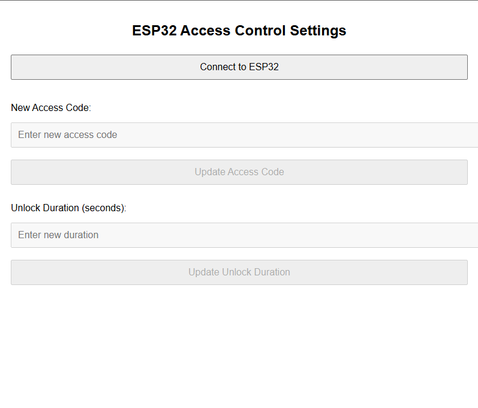
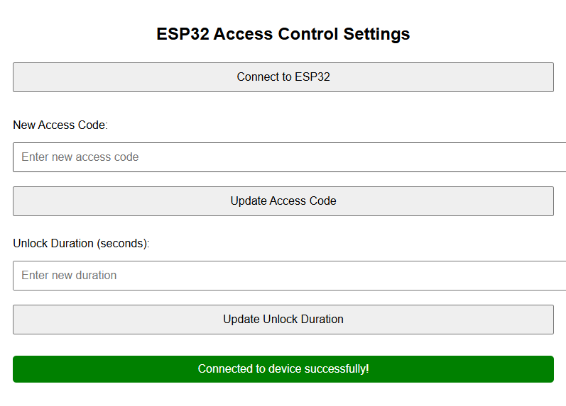
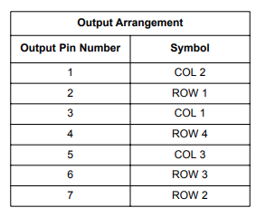

# IMP Access Terminal - Course project

This project is an implementation of a very trivial access system utilizing a keypad and two LEDs for ESP-32 written in C with ESP-IDF environment.
The system has a changable access code and is able to be configured via a simple web interface via Bluetooth Low Energy (BLE).

## **Project features**
- Keypad access terminal (LED glowing red for locked, green for unlocked)
- Customizable access code and unlocked state length duration (in code)
- Trivial webpage for configuring unlocked state length and access pin via BLE


## **Building the project**

For being able to use the project, you should be familiar with [ESP-IDF v5.3.1](https://docs.espressif.com/projects/esp-idf/en/v5.3.1/esp32/get-started/index.html)

### 1. Using the ESP-IDF VS Code extension
I recommend using the [IDF extension](https://github.com/espressif/vscode-esp-idf-extension) for setting up the project and flashing it to the device.

If u are using it, the steps (after having the device connected) to setup the environment would be following:

- Open the project folder
- Click on the ESP-IDF extension icon
- From commands, choose **"Select Serial Port"** and select the port you are using for your ESP board. The port should be called COMx, where x is the port number. See device manager to find the correct port number if you're unsure. Should you be on Linux, it will be something like /dev/ttyUSB0, check with ```dmesg``` if unsure.
- Click **"Build"** to build the project for flashing
- After succesfully building the project, click **"Flash"** to load it into the device
- The project should be up and running, you should notice the red LED turned on

### 2. Using ESP-IDF terminal

With the device already connected,

1. Start up the ESP-IDF Terminal
2. Go to project folder
3. Build the project

```sh
idf.py build
```

4. Flash the project

```sh
idf.py -p <PORT> flash
```


## **How to use**

After flashing the project on the device, even after disconnecting and reconnecting, the program should run there.

### Function check
The ESP board has a blue LED, that will start to shine with a bright blue color. This indicates the device is powered on.

### Keyboard LEDs
- **Green LED**: Indicates the system is in **unlocked** state
- **Red LED**: Indicates the system is in **locked** state

### Initial setup
By default, the device is preset to have access code **2165** and unlocked state length of **10 seconds**. You can change this by navigating to */main/src/access_control.c* and changing **access_code** and **unlock_duration** variables. Mind you, unlock duration is counted in miliseconds in the code.

### Standard function
The system is running in locked mode - the red LED is on - and waiting for user input.
If the system detects input length 4, it automatically submits the code. If the code is correct, the system will switch to unlocked state. If not, the red LED will blink three times - incorrect input indication.

The incorrect input indication happens in the following situations:
- Incorrect access code (e.g. 0000 when it is 1234)
- Nonsensical sequence (e.g. **** or ####)
- Incorrect access code change sequence (e.g. #12345)
- Correct access code change sequence, but incorrect access code (e.g. #1234*5678 when it should be #2165\*8745)

If you use the special access code change sequence correctly, the green LED will blink three times to confirm the change, then move on to unlocked state for the predefined period.

### Debug logs
The device doesn't have implemented much logging except logging key presses, but you can use idf.py monitor command or the Monitor option from ESP-IDF extension to open the monitor.

## **Web Bluetooth page**
This project includes a file called <span style="color:red">ble.html</span>, which is basically a simple web page that can be used to configure the access terminal via BLE.



The webpage consists of two simple inputs, one for updating the Access Code, second for updating the Unlock Duration in seconds.

To be able to use this page, follow these steps:

1. Press **"Connect to ESP32"** - this will open a dialog window with available bluetooth devices
2. Select **ESP-BLE**
3. Wait until the inputs unblock and you get a notification upon sucessfull pairing, like so:



At this point, you can manipulate the values as you wish, however

**YOU CAN ONLY UPDATE THE VALUES WHEN THE SYSTEM IS IN THE UNLOCKED STATE!!!**

The webpage will always inform you whether your action was or was not successful depending on whether you tried to submit in unlocked/locked state.

## Implementation
- The project was built entirely via ESP-IDF VS Code plugin using ESP-IDF v5.3.1, starting point was the hello world example from ESP-IDF

### Codebase
The whole codebase is in the *main* folder with the following structure:

```
main/
├── include/              # Header files
│   ├── access_control.h  
│   ├── gap.h             
│   ├── gatt_svc.h        
│   ├── gpio_config.h     
│   └── keypad.h         
│
└── src/                  # Source files
    ├── access_control.c  # Implementation of access control logic
    ├── gap.c             # Implementation of GAP configurations
    ├── gatt_svc.c        # Implementation of GATT services
    ├── gpio_config.c     # Implementation of GPIO configurations
    ├── keypad.c          # Implementation of keypad handling
    └── main.c            # Main application logic
CMakeLists.txt           # CMake project configuration
```

For implementation details, go see the header files and the source files themselves, everything is commented so it should be very clear. In this documentation, I will mention only the two hardest parts of this project to implement: the bluetooth functionality and keypad scanning.

### Bluetooth functionality
The bluetooth funcionality is mainly implemented thanks to amazing espressif GitHub examples available [here](https://github.com/espressif/esp-idf/tree/030c9957dbc5c5a627cf1bb4b2b856f1b6c1343c/examples/bluetooth/ble_get_started/nimble/NimBLE_GATT_Server)

This project basically uses the baseline funcionality from GATT Server, borrows *gap.h* and *gatt_svc.h* and their source files and reimplements them so they suit this project needs.

### Keypad


The keypad scanning functionality, implemented in *keypad.c*, is designed to detect and manage keypresses on the matrix keypad as efficently as possible. This process involves:

**Matrix Setup**: The keypad is structured into columns and rows, where each key corresponds to a unique combination of column and row. The columns are set as outputs and the rows as inputs.

**Scanning Logic**: The function *scan_keypad()* sequentially activates each column by setting it low and then checks each row for a low signal, indicating a button press at the intersection of the active column and row.

**Debouncing**: To ensure accurate keypress detection amidst potential signal noise, the function implements a debouncing mechanism. This is achieved by recording the time of the last keypress and ensuring that subsequent readings occur only after a specified debounce interval has elapsed, preventing the detection of false multiple presses from a single actual press. I played around with the debouncing time and 25 ms seems as a good choice for this setup.

**State Management**: The state of each keypress is tracked using three static variables: the last key pressed, the last press time, and whether the key has been released. This allows the function to detect and manage continuous presses and ensure that a key release is detected before another press of the same key is registered.

